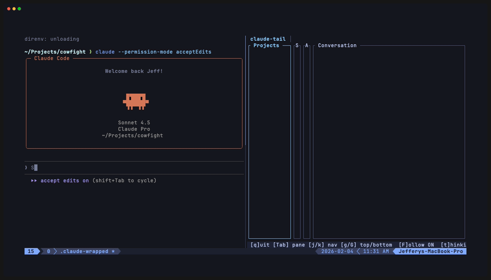

# claude-tail

A terminal UI for browsing Claude Code conversation logs.

Claude Code stores conversation history as JSONL files in `~/.claude/projects/`. This tool provides a fast, vim-style interface to browse those logs—including tool calls, thinking blocks, and sub-agent conversations.

## Demo

<p align="center">
  
</p>

## Features

- **Four-pane navigation**: Projects → Sessions → Agents → Conversation
- **Sub-agent support**: View main agent and spawned sub-agents separately
- **Real-time updates**: File watcher detects new messages as they arrive
- **Collapsible content**: Toggle thinking blocks and tool call details
- **Vim-style keys**: `j`/`k` navigation, `g`/`G` jump, `Ctrl-D`/`Ctrl-U` scroll
- **Themes**: Six built-in Base16 themes; add custom themes via YAML

## Installation

### From source

```bash
git clone https://github.com/jeffutter/claude-tail
cd claude-tail
cargo build --release
./target/release/claude-tail
```

### Nix

```bash
nix run github:jeffutter/claude-tail
```

Or add to your flake inputs:

```nix
{
  inputs.claude-tail.url = "github:jeffutter/claude-tail";
}
```

## Usage

```bash
claude-tail                           # Launch with default theme
claude-tail --theme catppuccin-mocha  # Use a specific theme
claude-tail --list-themes             # Show available themes
```

### Keyboard shortcuts

#### Global

| Key | Action |
|-----|--------|
| `Tab` | Next pane |
| `Shift+Tab` | Previous pane |
| `t` | Toggle thinking blocks |
| `e` | Toggle tool expansion |
| `f` | Toggle follow mode (auto-scroll) |
| `?` | Toggle help |
| `q` / `Ctrl+C` | Quit |

#### List panes (Projects, Sessions, Agents)

| Key | Action |
|-----|--------|
| `j` / `↓` | Move down |
| `k` / `↑` | Move up |
| `g` | Jump to top |
| `G` | Jump to bottom |
| `Enter` | Focus next pane |

#### Conversation pane

| Key | Action |
|-----|--------|
| `j` / `↓` | Scroll down |
| `k` / `↑` | Scroll up |
| `Ctrl+D` | Half-page down |
| `Ctrl+U` | Half-page up |
| `PageDown` / `PageUp` | Full page scroll |
| `g` / `G` | Jump to top/bottom |

### Themes

Built-in themes:
- `tokyonight-storm` (default)
- `catppuccin-mocha`
- `dracula`
- `gruvbox-dark`
- `nord`
- `solarized-dark`

Add custom themes by placing Base16 YAML files in `~/.config/claude-tail/themes/`.

## Development

```bash
cargo check    # Type checking
cargo build    # Debug build
cargo run      # Run debug build
cargo clippy   # Linting
cargo fmt      # Format code
cargo test     # Run tests
```

## License

MIT
